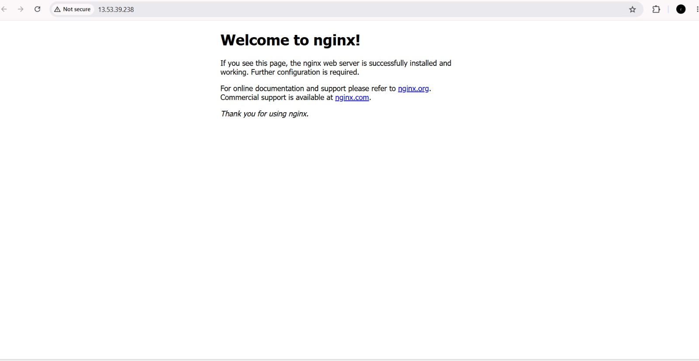

# Scalable Web Application Deployment on AWS Cloud

## Overview
Large-scale applications like Netflix, Amazon, and Instagram run on cloud 
infrastructure (largely AWS) to reliably serve millions of users — using 
virtual servers, network security layers, and real-time monitoring instead 
of physical hardware.

This project implements the same *core deployment principles* at a small 
scale: provisioning a cloud server, securing it, deploying a web application 
on it, monitoring its health, and handling failures — the foundational 
building blocks behind how large platforms stay available and reliable.

## What Was Built
- Provisioned a virtual server (EC2) on AWS Cloud — the same core compute 
  service used to run scalable applications
- Configured network security (Security Groups) to control public access, 
  similar to how production systems restrict and manage traffic
- Deployed a live web application (Nginx) accessible over the internet
- Implemented real-time health monitoring (CloudWatch) to detect issues — 
  the same monitoring principle used in production incident management
- Simulated a service outage and resolved it — practicing the exact 
  incident-response workflow systems engineers use at scale
- Documented the entire process as a Standard Operating Procedure (SOP)
- 

## Real-World Parallel
Platforms like Netflix run thousands of servers across global regions, 
behind load balancers, with automated monitoring and alerting — but the 
underlying building blocks are the same ones demonstrated here: 
**compute (EC2) → network security (Security Groups) → monitoring 
(CloudWatch) → incident response.** This project is a hands-on, smaller-scale 
implementation of those same fundamentals.

## Architecture
**Request Flow:**
Internet → Security Group (Firewall: Port 80/22) → EC2 Instance (Ubuntu Linux) → Nginx Web Server
**Monitoring Layer:**
CloudWatch tracks EC2 CPU Utilization → Alarm triggers if usage exceeds threshold
## Skills Demonstrated
- AWS EC2 provisioning and Linux server administration
- Network security configuration (Security Groups)
- Application deployment (Nginx)
- Cloud monitoring and alerting (CloudWatch)
- Incident troubleshooting and resolution
- Technical documentation (SOP)

## Troubleshooting Case Study
**Issue:** Web application unreachable — "Connection refused."
**Root Cause:** Missing inbound Security Group rule for HTTP (port 80).
**Fix:** Added inbound rule (port 80, source 0.0.0.0/0); verified via browser reload.

## Tools & Services Used
AWS EC2, AWS CloudWatch, AWS Security Groups (VPC), Ubuntu Linux, Nginx
